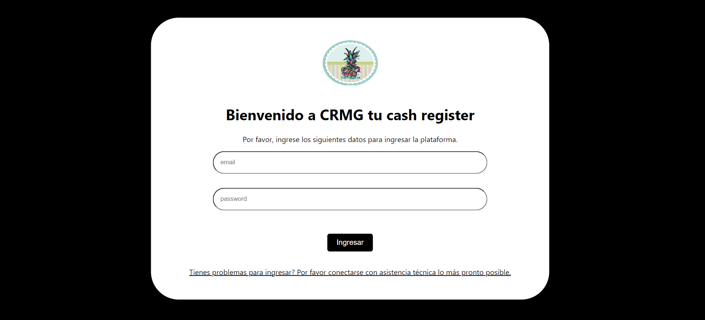

Este proyecto tiene como fin poder crear una caja registradora como una app se va a crear utilizando javascript, Node.Js para el backend y el front utilizamos react, tambien vamos a hacerlo para movil utilizando react native con expo, esta app va a ir con su respetivo crud login y validacion tambien utilzando jsonWebTokens

