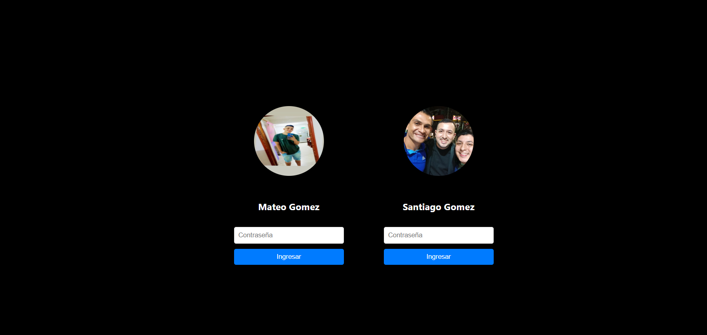
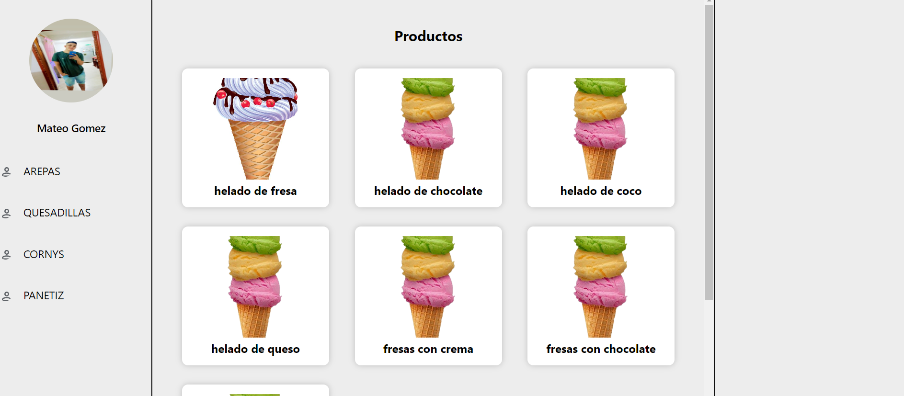
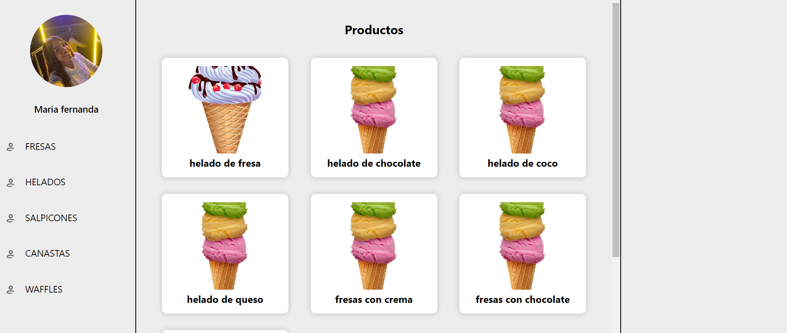

Este proyecto tiene como fin poder crear una caja registradora como una app se va a crear utilizando javascript, Node.Js para el backend y el front utilizamos react, tambien vamos a hacerlo para movil utilizando react native con expo, esta app va a ir con su respetivo crud login y validacion tambien utilzando jsonWebTokens

login compañias CRMG

login para usuarios de las compañias CRMG,
compañia : xrlt@gmail.com

compañia : grmr@gmail.com

el usuario inicia sesion dependiendo si es admin o usuario puede modificar las categorias y productos que tengan cada compañia

usuario de grmr@gmail.com

usuario de xrlt@gmail.com

